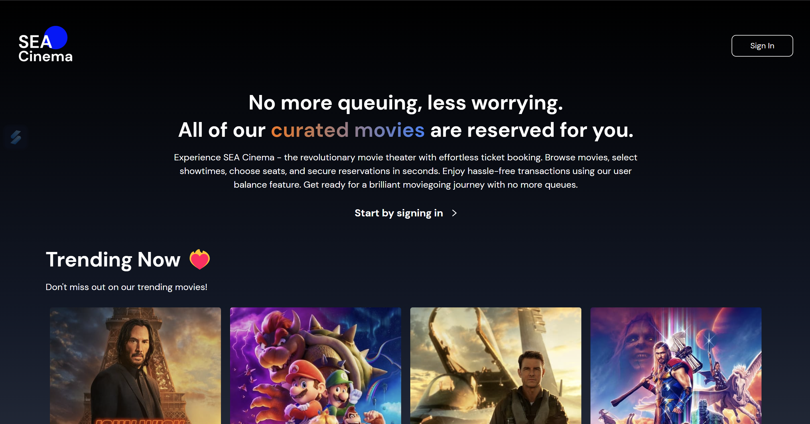

#SEACinema

SEACinema is a project that I built as part of the SEA Compfest challenge. The main goal of this project is to create a movie-ticketing website. Throughout the development process, I gained valuable experience in creating dynamic user interfaces, combining different logics, and working with APIs.

The app includes various features, such as a user authentication system implemented using Firebase. Users are able to top up and withdraw their balance, as well as book cinema seats. To enhance the user experience, the app utilizes localStorage to maintain and retrieve user input, ensuring that their selections are preserved even if the page is refreshed.

Currently, the app does not support individual balance tracking, as I am still exploring ways to store booking receipts and changes in Firestore. In the future, I plan to implement new features, develop responsive UIs, including a booking history section, and further enhance the back-end development of the project.

Overall, building SEACinema has been an enriching experience, allowing me to learn and apply various concepts in web development while striving to create a functional and user-friendly movie-ticketing platform.

# Getting Started with Create React App

This project was bootstrapped with [Create React App](https://github.com/facebook/create-react-app).

## Available Scripts

In the project directory, you can run:

### `npm start`

Runs the app in the development mode.\
Open [http://localhost:3000](http://localhost:3000) to view it in your browser.
